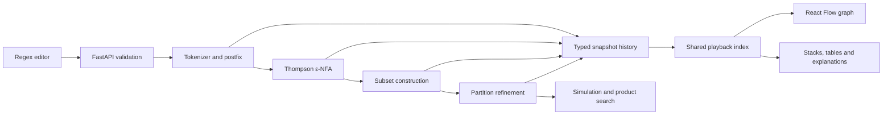

# Architecture

AutomataLab is a local React application backed by a stateless Python compiler. Its educational output is an ordered execution history, not a collection of prewritten diagrams.

## Backend boundaries

`algorithms/core.py` contains a mutable internal automaton, outgoing-edge index, deterministic state ordering, errors, and request budgets. A transition's `symbol=None` denotes epsilon. The epsilon sentinel never enters an alphabet.

`parser.py`, `thompson.py`, `subset.py`, `minimization.py`, `simulation.py`, and `equivalence.py` implement the algorithms. They accept a computation budget and emit typed events directly where operations occur. Their logic has no FastAPI dependency. `compiler.py` composes them; `main.py` handles HTTP validation, documented response models, local CORS, and error conversion.

Every graph identifies its kind, state IDs, sorted alphabet, initial state, accepting states, and transitions with stable IDs. Construction snapshots may be empty or incomplete: their `start` can be null until the first state is created. Completed results satisfy full automaton invariants.

## Execution history

`TraceEvent` has common metadata and a discriminated `data.kind` union for parser, NFA, DFA, minimization, simulation, and comparison events. Each event includes the actual explanation, pseudocode line, highlights, and the context needed at that step. Construction events contain graph snapshots. Parser events contain the output and operator stack; DFA events contain subset mappings, worklists, and detailed epsilon-closure traversal; minimization events contain partitions and signatures.

Snapshots are deeply detached when recorded. Later mutations cannot change earlier events. This makes a timeline seek a simple array lookup, so backward navigation restores graph, tables, and algorithm data together. Graphs for fixed automata are passed separately to simulation/comparison views. Snapshot limits prevent unbounded history growth.

The epsilon-closure explorer runs inside subset construction. The left graph highlights the visited NFA states and epsilon edge being traversed while the right graph shows the DFA that exists at that event. New DFA subsets are enqueued exactly once.

## Frontend boundaries

`App.tsx` owns navigation, input, compilation result, theme, and recent-expression state. The application uses React state instead of an unnecessary router or global store. Examples fill the editor without compiling. Editing invalidates the previous result.

`useRequest` owns an AbortController and a monotonically increasing request number. Aborting alone is insufficient: even if an older request resolves, the number check prevents it from replacing a newer result. Unmount and reset invalidate in-flight work.

`usePlayback` owns the selected event, play/pause state, speed, and one timeout. Seeking pauses playback. Stage components remount predictably, reset to step zero, and clean up their timers. Input fields retain ordinary keyboard behavior.

`GraphCanvas` is shared by construction, simulation, and comparison. State and edge highlighting comes exclusively from event data. Dagre lays out the completed stage topology, and earlier snapshots use the relevant positions to avoid random rearrangement. For NFAs, a shortest-depth skeleton guides layout to keep epsilon bypasses from stretching the graph into a long row; the renderer still draws every actual transition. Manual dragging and keyboard movement change only display positions. Grouped edges retain every underlying transition ID, so highlighting remains faithful to algorithm events. Fullscreen inspection is available for larger diagrams.

The graph renderer draws initial arrows, double accepting circles, self-loops, and separate curves for opposing directions. Export uses the same edge geometry and actual node positions, independent of the viewport. SVG is generated directly; PNG is drawn from that SVG using native canvas. No image-generation or remote rendering service is involved.

## Reliability boundaries

Input validation, state counts, traversal budgets, trace payload estimates, product-search counts, and elapsed-time checks are enforced on the server. Unknown request fields and wrong types are rejected. Errors do not disclose internal exceptions. The user receives a resource-limit error rather than an apparently valid partial result.

The app intentionally has no database, authentication, cloud dependency, or external runtime network calls. Local storage is optional and failures to access it do not stop compilation.
